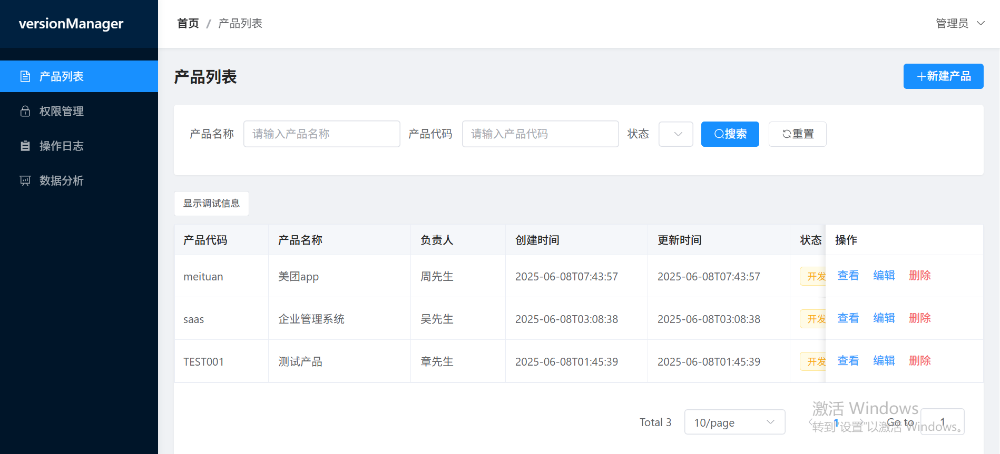
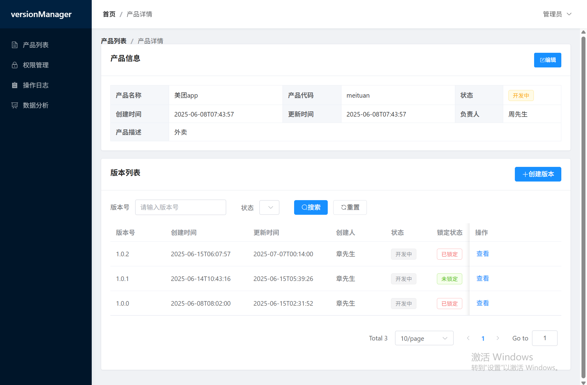
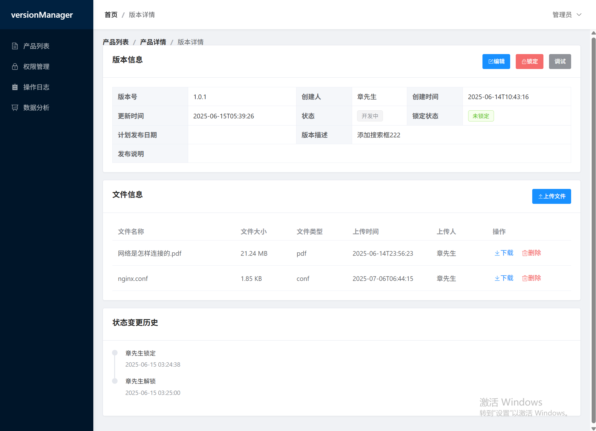
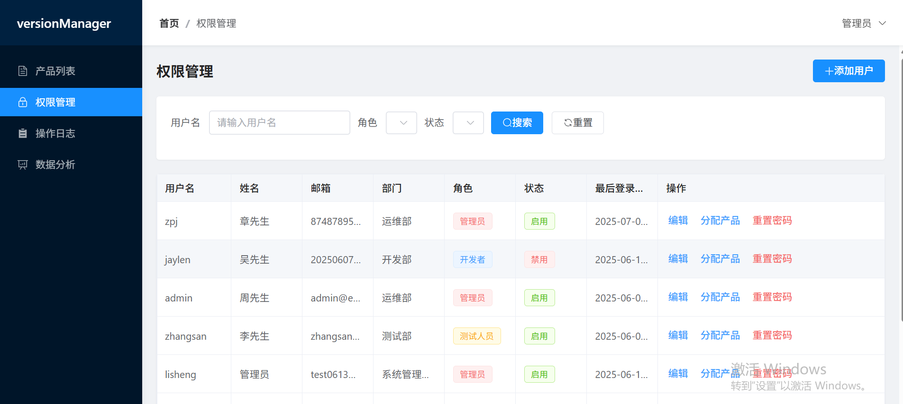
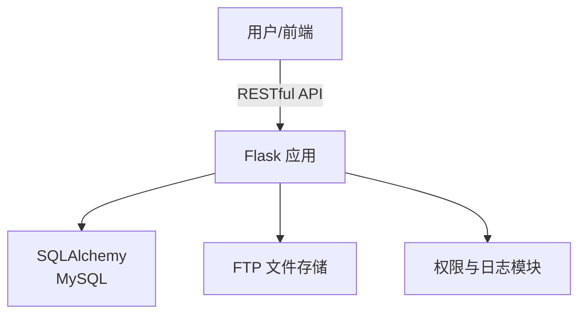

# Version Manager —— 企业级 Flask 版本管理平台

> 🚀 一站式版本管理、文件存储与权限控制解决方案

---

## 项目简介

**Version Manager** 是一款基于 Flask 框架开发的企业级版本管理平台，集成了 MySQL 数据库操作、FTP 文件存储、细粒度权限控制与操作日志，助力企业高效、安全地管理产品版本与文件。  
本项目采用模块化、可扩展的架构设计，适合中大型团队协作与二次开发。

---

## 核心特性

- **企业级架构**：清晰分层，易于维护与扩展
- **多用户与权限管理**：支持角色分配、产品权限、操作日志审计
- **版本与文件管理**：高效追踪产品版本，支持大文件上传与存储
- **FTP 集成**：安全、稳定的文件存储方案
- **RESTful API**：前后端分离，易于对接各类前端/第三方系统
- **易于部署**：支持 Docker 一键部署，环境配置灵活

---
## 功能预览

<table align="center" width="100%">
  <tr>
    <td align="center" width="50%">
      
    </td>
    <td align="center" width="50%">
      
    </td>
  </tr>
  <tr>
    <td align="center">
      
    </td>
    <td align="center">
      
    </td>
  </tr>
</table>

---

## 技术架构



- **后端**：Flask + Flask-RESTful + SQLAlchemy + Alembic
- **数据库**：MySQL
- **文件存储**：FTP
- **环境管理**：python-dotenv
- **部署**：Docker / Docker Compose

---

## 目录结构

```bash
version_manager/
├── app/
│   ├── api/           # API 路由与资源
│   ├── models/        # 数据模型
│   ├── services/      # 业务逻辑
│   ├── utils/         # 工具函数
│   ├── config.py      # 配置
│   └── extensions.py  # 扩展初始化
├── migrations/        # 数据库迁移
├── tests/             # 单元测试
├── requirements.txt   # 依赖
├── run.py             # 启动入口
└── ...
```

---

## 快速开始

1. **克隆项目**
   ```bash
   - 后端
   git clone https://github.com/opsre/version_manager.git
   cd version_manager
   - 前端
   git clone https://github.com/zpj874878956/version_manager_ui.git
   cd version_manager_ui
   ```

2. **环境准备**
   ```bash
   python -m venv venv
   venv\Scripts\activate
   pip install -r requirements.txt
   ```

3. **配置数据库与环境变量**
   - 编辑 `.env` 文件，配置数据库、FTP 等信息

4. **初始化数据库**
   ```bash
   执行version-manager.sql
   ```

5. **启动服务**
   ```bash
   python run.py
   ```

6. **Docker 一键部署**
   ```bash
   docker-compose up -d
   ```
7. **演示地址**
   ```bash
   http://121.37.210.217:8080/
   账号：test
   密码：123456
   ```
8. **根据产品code和版本号获取版本是否锁定的方式**
参考脚本version_lock.sh

9. **最佳使用方式案例**
在jenkins流水线中使用shell脚本version_lock.sh调用该接口，实现版本的锁定与解锁。

---

## 常见问题（FAQ）

1. **如何备份与恢复数据？**  
   只需备份数据库和 FTP 存储目录，恢复时还原即可。

2. **如何扩展业务逻辑？**  
   新增业务只需在 `services/`、`models/`、`api/resources/` 目录下添加对应模块。

3. **如何对接前端？**  
   所有功能均通过 RESTful API 提供，详见 `api.md` 文档。

4. **权限系统如何运作？**  
   支持角色、产品、用户多维度权限分配，详见 `app/models/role.py`。

---

## 未来规划

- 支持版本数据分析
- 优化界面UI


---

## 致谢

- 感谢 Flask、SQLAlchemy等开源项目

---

## License

MIT License

---

> 🌟 如果你觉得本项目有帮助，欢迎 Star、Fork、提 Issue 或 PR！

---

如需定制开发或企业支持，请联系 874878956@qq.com

**打赏**
| 二维码 |
| :-------------: |
|  |
